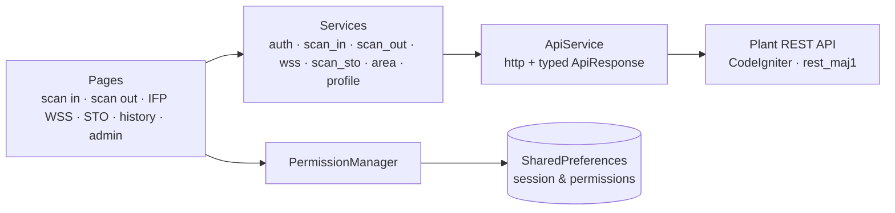

<div align="center">

# 🚚 My Armada

**All-in-one mobile app for internal plant operations: barcode scan-in and scan-out per warehouse area, stock-taking, history, and fine-grained user permissions.**


</div>

---

## Overview

Moving parts between warehouse areas at a manufacturing plant (raw material, in-process and finished parts) has to be recorded at the moment it happens. Otherwise stock in the system drifts away from what is physically on the racks.

**My Armada** puts that recording in operators' pockets. They scan a part tag with the phone camera (or type it in if the label is damaged), and the movement is posted straight to the plant's REST backend. Each operator only sees the menus and areas they have been granted.

## Features

| Menu | What it does |
|---|---|
| **Scan In** | Record parts entering an area (IFPD, IFPP, IFRM), by camera scan or manual entry, with a detail check before posting |
| **Scan Out** | Record parts leaving an area, with the same scan, check and confirm flow |
| **Scan IFP WSS** | Scan parts into WSS: check the part, detect duplicate scans, post, and view current WSS stock |
| **Scan STO** | Stock-taking scans during an STO event |
| **History** | Per-menu history of scans for IFP WSS, scan in/out and STO |
| **Profile** | Operator info and session |
| **User Management** (admin) | Grant each user **view** and **input** permissions per menu and per area |

Other details:
- **Permission-driven UI**: `utils/permissions.dart` defines permissions such as `view.scanInIfpd` or `input.scanOutIfrm`, and the home screen and each page render only what the user is allowed to see or do.
- **Consistent feedback**: shared dialogs for loading, success, error, confirmation and API responses.
- **Diagnostics**: structured logging, with optional remote logging to the server.

## Architecture



```
lib/
  components/   barcode scanner, manual scan-in/out/STO forms, detail sheets, dialogs
  config/       API base URL, endpoints and timeouts
  layout/       app shell and navigation
  models/       ApiResponse, UserModel, WssModel
  pages/        home, scan_in, scan_out, scan_ifp_wss, scan_sto, histories, profile, admin/user_management
  services/     one service per domain on top of a shared ApiService
  utils/        permissions, permission manager and widget, logger, shared prefs, helpers
```

## Tech Stack

| Area | Packages |
|---|---|
| Framework | Flutter, Dart |
| Scanning | `mobile_scanner` |
| Networking | `http` with a typed `ApiResponse` wrapper |
| Storage | `shared_preferences` |
| Logging | `logging` |
| UI | `carousel_slider`, `intl` |

## Getting Started

```bash
flutter pub get
flutter run
```

Point the app at your backend by setting `baseUrl` in [`lib/config/api_config.dart`](lib/config/api_config.dart). The endpoints live under `/scan_barcode/*` and `/auth/*` and are served by the plant REST API ([`rest_maj1`](https://github.com/efrino/rest_maj1)).

## Related

- [**rest_maj1**](https://github.com/efrino/rest_maj1): CodeIgniter REST backend providing the scan, stock and auth endpoints
- [**sto**](https://github.com/efrino/sto): dedicated stock-taking tag printing and counting app for handheld devices

## Author

**Efrino Wahyu Eko Pambudi**: [GitHub](https://github.com/efrino) · [LinkedIn](https://www.linkedin.com/in/efrinowep/) · [Portfolio](https://efrino.netlify.app)
